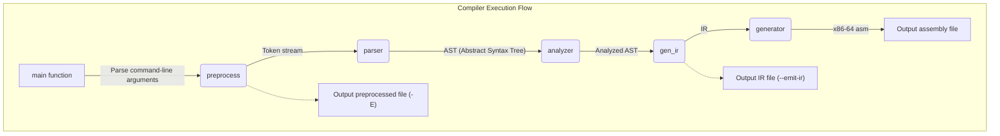

# My C Compiler

## Features

- **Partial C99 Support:** Implements a significant portion of the C99 standard. Floating-point types are not supported. There are no plans to support features deprecated in C23 or later. The currently parsable EBNF can be found in `grammar/my_parser.ebnf`.
- **x86-64 Assembly Generation:** Generates assembly code for the x86-64 architecture.
- **Preprocessor:** Supports macros, conditional compilation (`#if`, `#ifdef`, etc.), and file inclusion (`#include`).
- **Intermediate Representation (IR):** Uses a custom three-address code-like intermediate representation. The IR can be dumped for debugging purposes. An interpreter for the IR is also under development.
- **Testing Framework:** You can run the tests in `test.sh` by executing `make test`.

## Requirements

Verified to work on Ubuntu 24.04 LTS and Manjaro 25.0.6.

`gcc` and `make` are required. `cargo` is required to run `test.rs`.

## Building

Run the following command on the command line to build:
```bash
make
```
An executable file named `main` will be created.

## Usage

```bash
./main -i <input_file.c> -o <output_file.s>
```

### Options

- `-E`: Executes only the preprocessor and outputs the result to standard output.
- `-g`: Defines GCC-compatible predefined macros.
- `-o <file>`: Specifies the output file name.
- `-i <file>`: Specifies the input file name.
- `-I <string>`: Uses the given string as input.
- `--emit-ir`: Outputs the Intermediate Representation (IR) instead of assembly code.

## Testing

To run the tests:

```bash
make test
```

## Self-Hosting

To build the compiler with itself:

```bash
make self1
```

This will create a new executable file named `main2`.

If you want to run tests with the self-hosted compiler, you can do so with the following command:
```bash
make self1-test
```

## Intermediate Representation

This compiler uses its own IR in the compilation process.

For details on the IR, see the [IR documentation](./IR.md).

## Compilation Flow



[日本語版](README_JP.md)