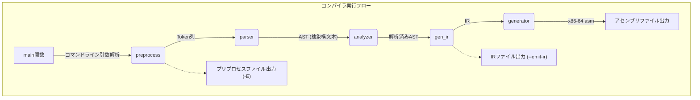

# 自作Cコンパイラ

## 機能

- **C99サポート（部分的）:** C99規格の主要な部分を実装しています。不動小数点型等はサポートしていません。また、C23等で廃止された機能についてもサポート予定はありません。現在パースできるEBNFは`grammar/my_parser.ebnf`にあります。
- **x86-64アセンブリ生成:** x86-64アーキテクチャ用のアセンブリコードを生成します。
- **プリプロセッサ:** マクロ、条件付きコンパイル（`#if`, `#ifdef`など）、ファイルインクルード（`#include`）をサポートしています。
- **中間表現（IR）:** 独自の3アドレスコード風の中間表現を使用します。デバッグ目的でIRをダンプすることが可能です。また、IRのインタープリタも作成中です。
- **テストフレームワーク:** `make test`を実行することで`test.sh`にあるテストを実行することが可能です。

## 要件

ubuntu 24.04 LTS と Manjaro 25.0.6 での動作を確認しています。

`gcc`、`make`が必須で、`test.rs`の実行には`cargo`が必要です。

## ビルド方法
コマンドラインで以下を実行すればビルドされます。
```bash
make
```
`main`という名前の実行可能ファイルが作成されます。

## 使い方

```bash
./main -i <input_file.c> -o <output_file.s>
```

### オプション

- `-E`: プリプロセッサのみを実行し、結果を標準出力に出力します。
- `-g`: GCC互換の定義済みマクロを定義します。 `-E`と共に利用できます。
- `-o <file>`: 出力ファイル名を指定します。
- `-i <file>`: 入力ファイル名を指定します。
- `-I <string>`: 与えられた文字列を入力として使用します。
- `--emit-ir`: アセンブリコードの代わりに中間表現（IR）を出力します。

## テスト

テストを実行するには：

```bash
make test
```

## セルフホスティング

コンパイラ自身でビルドするには：

```bash
make self1
```

これにより、`main2`という名前の実行可能ファイルが作成されます。

セルフホストしたコンパイラでテストを実行したい場合は以下のコマンドでテストができます。
```bash
make self1-test
```

## 中間表現

このコンパイラはコンパイルプロセスにおいて独自のIRを利用しています。

IRの詳細については、[IRドキュメント](./IR_JP.md)を参照してください。

## コンパイルフロー



[English Version](README.md)
